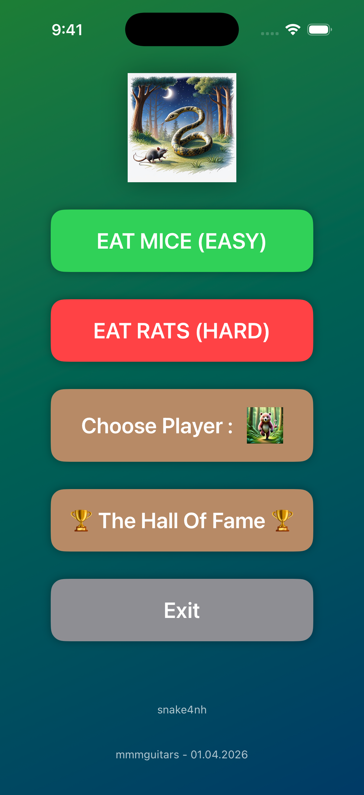
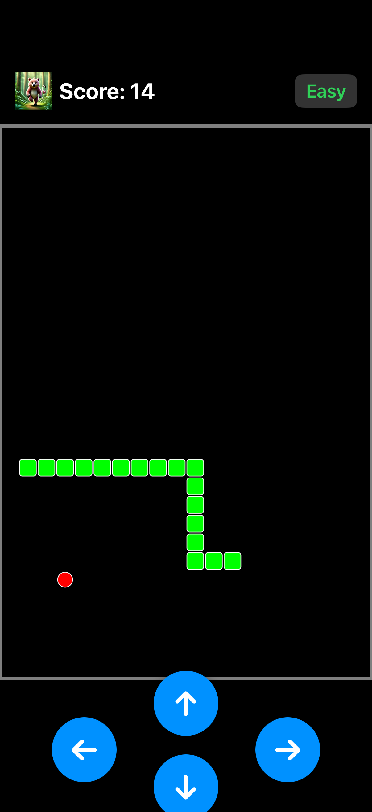
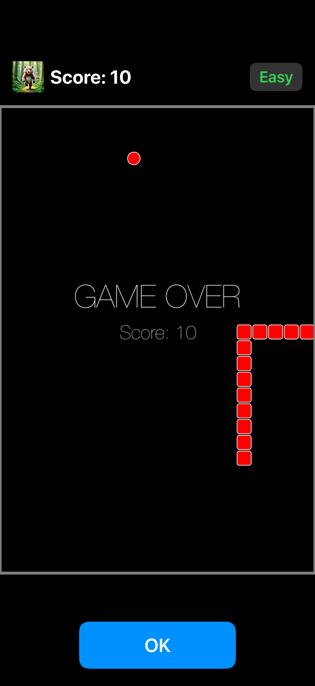
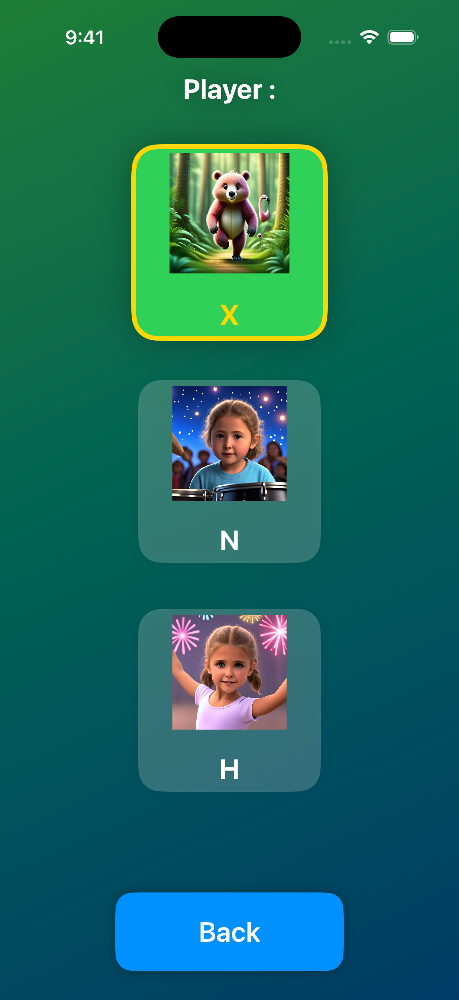
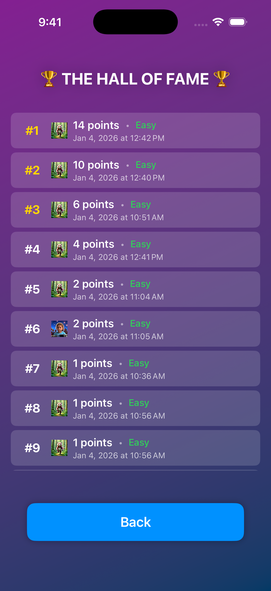

# Snake 4 N&H

My girls (N&H) wanted a simple snake game on their non-wifi connected iphones. An opportunity to learn a bit of Xcode/Swift and Spritekit. Take my work and mod it to your liking, such as adding icons for your own kids. 

## Description

The core classics are included : Guide your snake around the playing field, eat food to grow longer, and avoid crashing into walls or yourself. The game features two difficulty levels and supports multiple player profiles. Targetted for iOS 26. 

## Features

- **Two Difficulty Levels**: Choose between Easy (Mouse) and Hard (Rat) modes with different snake speeds
- **Player Profiles**: Select from three different player profiles with custom icons
- **Hall of Fame**: Track your top 10 high scores with player, difficulty, and timestamp information
- **Persistent Scores**: All scores are saved locally and persist across app restarts
- **Visual Feedback**: Gray walls border the play area, and the snake turns red on game over
- **Sound Effects**: Audio feedback for eating food, changing direction, and game over
- **Touch Controls**: Directional buttons for snake movement to emulate the old school phone keypads 

## Screenshots

---
**mmmguitars - 01.04.2026**
